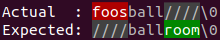

## Automatic message generation

```typescript
const number = "1234567";

requireThat(number as unknown, "number").isString().length().isLessThanOrEqualTo(5);
```

```text
RangeError: number may not contain more than 5 characters.
Actual: 7
number: 1234567
```

## Diffs provided whenever possible

Not only do we provide you with the actual and expected values, we also provide a diff whenever possible.

```typescript
const actual = [2, 3, 4, 6];
const expected = [1, 3, 5];

requireThat(actual, "actual").containsAll(expected);
```

```text
RangeError: actual must contain all elements in: [1, 3, 5]
Actual : [2, 3, 4, 6]
Missing: [1, 5]
```

## Assertion support

If you need to run in a high performance, zero allocation environment (to reduce latency and jitter) look no
further than the following design pattern:

```typescript
import {assertThat} from "@cowwoc/requirements";

class Person
{
  public void eatLunch()
  {
    assertThat("time", new Date().getHours()).isGreaterThanOrEqualTo(12, "noon").elseThrow();
  }
}
```

Use a build tool like Terser to declare `assertThat()` as a pure function and it will be stripped out from production builds.

## Multiple validation failures

```typescript
const name = "George";
const province = "Florida";
const provinces = ["Ontario", "Quebec", "Nova Scotia", "New Brunswick", "Manitoba",
  "British Columbia", "Prince Edward Island", "Saskatchewan", "Alberta", "Newfoundland and Labrador"];

const failures = checkIf(name, "name").length().isBetween(10, 30).elseGetFailures();
failures.addAll(checkIf(provinces, "provinces").contains(province).elseGetFailures());

for (const failure of failures)
  console.log(failure.getMessage());
```

Output will look like:

```
name must contain [10, 30) characters.

"provinces" must contain provide "province".
province: Florida
Actual: [Ontario, Quebec, Nova Scotia, New Brunswick, Manitoba, British Columbia, Prince Edward Island, Saskatchewan, Alberta, Newfoundland and Labrador]
```

## Nested validations

Nested validations facilitate checking multiple properties of a value. For example,

```typescript
const nameToAge = new Map();
nameToAge.set("Leah", 3);
nameToAge.set("Nathaniel", 1);

requireThat(nameToAge, "nameToAge").
keys().containsAll(["Leah", "Nathaniel"]);
requireThat(nameToAge, "nameToAge").
values().containsAll([3, 1]);
```

can be converted to:

```typescript
requireThat(nameToAge, "nameToAge").
  and(k => k.keys().containsAll(["Leah", "Nathaniel"])).
  and(v => v.values().containsAll([3, 1]));
```

## String diff

When
a [String comparison](https://cowwoc.github.io/requirements.js/4.0.8/docs/api/ObjectVerifier.html#isEqualTo)
fails, the library outputs a diff of the values being compared.

Depending on the terminal capability, you will see a [textual](Textual_Diff.md) or a colored diff.



Node supports colored exception messages. Browsers do not.

## Returning the value after validation

You can get the value after validating or transforming it, e.g.

```typescript
class Player
{
	private name: string;

	constructor(name)
	{
		this.name = requireThat(name, "name").isNotEmpty().getValue();
	}
}
```